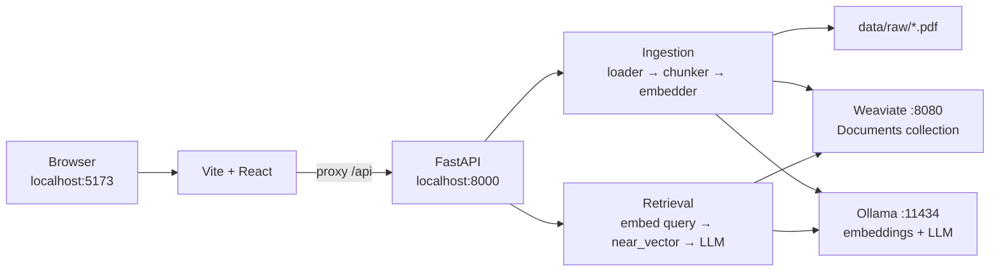

# System Architecture — RAG Document Assistant

> Last updated: July 2026 · Reflects the current codebase as implemented.

This document describes the full system so a new reader can understand purpose, layout, data flow, APIs, configuration, known defects, and recommended improvements without reading every source file first.

---

## 1. What This System Does

**RAG Document Assistant** is a local Retrieval-Augmented Generation app:

1. User uploads a **PDF**.
2. Backend extracts text, splits it into chunks, embeds chunks with **Ollama**, and stores vectors in **Weaviate**.
3. User asks a question in the chat UI.
4. Backend embeds the question, retrieves the top‑k similar chunks, and asks an **Ollama LLM** to answer using that context.
5. The UI shows the answer plus source snippets.

There is **no authentication**, **no multi-tenancy**, and **no conversation memory**. Everything runs on one shared Weaviate collection (`Documents`).

---

## 2. High-Level Architecture



### Runtime services

| Service | How it runs | Port | Role |
|---------|-------------|------|------|
| React / Vite | `npm run dev` in `frontend/` | 5173 | UI; proxies `/api` → backend |
| FastAPI | `uvicorn app.main:app --reload` | 8000 | Upload + chat APIs |
| Weaviate | `docker-compose up -d` | 8080 (HTTP), 50051 (gRPC) | Vector store |
| Ollama | Installed separately on the host | 11434 | Embeddings + generation |

`docker-compose.yml` only starts **Weaviate**. Ollama is expected to be running locally with the configured models pulled.

---

## 3. Technology Stack

| Layer | Technology | Notes |
|-------|------------|-------|
| Backend | Python 3.x, FastAPI, Uvicorn, Pydantic | Entry: `app/main.py` |
| Frontend | React 19.2.7, TypeScript 5.2.2, Vite 5 | SPA, no router |
| PDF | PyPDF2 (`PdfReader`) | Text extraction only |
| Embeddings | `langchain_ollama.OllamaEmbeddings` | Model from `EMBEDDING_MODEL` |
| LLM | `ollama.generate()` | Model from `OLLAMA_MODEL` |
| Vector DB | Weaviate 1.38.1 | Custom vectors (`Vectorizer.none()`) |
| Config | `python-dotenv` + `config/settings.py` | Env-driven constants |
| Infra | Docker Compose | Weaviate volume `weaviate_data` |

### Declared Python deps (`requirements.txt`)

`langchain`, `langchain-ollama`, `weaviate-client`, `fastapi`, `uvicorn`, `python-multipart`, `pydantic`, `ollama`, `python-dotenv`, `PyPDF2`

---

## 4. Project File Structure

```
RAG_Project/
├── app/
│   └── main.py                 # FastAPI app, CORS, lifespan, /api/upload, /api/chat
├── config/
│   ├── .env                    # Runtime environment variables (secrets / local config)
│   └── settings.py             # Loads env → module-level constants
├── data/
│   └── raw/                    # Uploaded / sample PDFs on disk
├── ingestion/                  # Document → chunks → embeddings
│   ├── __init__.py
│   ├── loader.py               # load_pdf()
│   ├── chunker.py              # chunk_text()
│   └── embedder.py             # get_embedder(), embed(), create_query_embeddings()
├── retrieval/                  # Vector store + RAG answer
│   ├── __init__.py
│   ├── vectorstore.py          # get_client(), create_collection(), store_documents()
│   └── retriever.py            # ask()
├── evaluation/
│   ├── __init__.py
│   └── ragas_eval.py           # Empty — RAGAS eval not implemented
├── frontend/                   # React + Vite UI
│   ├── index.html              # Title: "RAG Document Assistant"
│   ├── package.json
│   ├── vite.config.ts          # Dev proxy: /api → http://localhost:8000
│   ├── tsconfig.json
│   └── src/
│       ├── index.tsx           # React createRoot entry
│       ├── App.tsx             # Layout: FileUpload + ChatInterface
│       └── components/
│           ├── FileUpload.tsx
│           ├── ChatInterface.tsx
│           └── SourceCitation.tsx
├── .vscode/                    # Editor settings (e.g. python.analysis.extraPaths)
├── docker-compose.yml          # Weaviate 1.38.1 only
├── requirements.txt
├── script.py                   # Utility: wipe Weaviate "Documents" collection
├── frontend.py                 # Empty stub (unused)
├── Readme.md                   # Currently empty
├── .gitignore                  # Currently only ignores ".env"
└── systemarch.md               # This document
```

---

## 5. Module Reference

### 5.1 `app/main.py` — API entry point

| Symbol | Role |
|--------|------|
| `app` | `FastAPI(lifespan=lifespan)` |
| `QueryRequest` | Pydantic body: `{ question: str }` |
| `upload_documents` | `POST /api/upload` — save PDF → ingest → store |
| `chat_with_pdf` | `POST /api/chat` — call `ask()` → map sources for UI |
| `lifespan` | Open Weaviate client, ensure collection exists, close on shutdown |

CORS allows origin `http://localhost:5173` only.

### 5.2 `config/settings.py` — Configuration

Loads via `load_dotenv(dotenv_path=Path(__file__).resolve().parent / ".env")` (explicitly targets `config/.env`).

| Constant | Env var | Default | Used by |
|----------|---------|---------|---------|
| `OLLAMA_MODEL` | `OLLAMA_MODEL` | None | `retriever.ask` |
| `EMBEDDING_MODEL` | `EMBEDDING_MODEL` | None | `embedder.get_embedder` |
| `weaviate_url` | `weaviate_url` | None | Loaded but unused (`connect_to_local()` ignores it) |
| `CHUNK_SIZE` | `chunk_size` | `1000` | `chunker.chunk_text` |
| `CHUNK_OVERLAP` | `chunk_overlap` | `200` | `chunker.chunk_text` |
| `TOP_K` | `top_k` | `5` | `retriever.ask` |
| `FILEPATH` | `FILEPATH` | None | Upload save path prefix in `main.py` |

Also present in `config/.env` but **not read by settings:** `OLLAMA_API`.

### 5.3 Ingestion

| File | Function | Behavior |
|------|----------|----------|
| `loader.py` | `load_pdf(file_path)` | Concatenates `extract_text()` from every PDF page |
| `chunker.py` | `chunk_text(text, chunk_size=..., chunk_overlap=...)` | Sliding character windows: advance by `chunk_size - chunk_overlap` |
| `embedder.py` | `get_embedder()`, `embed(chunks)`, `create_query_embeddings(query)` | LangChain Ollama embeddings for docs / single query |

### 5.4 Retrieval

| File | Function | Behavior |
|------|----------|----------|
| `vectorstore.py` | `get_client()` | `weaviate.connect_to_local()` |
| | `create_collection(client)` | Creates `Documents` if missing (idempotent; does **not** wipe existing data) |
| | `store_documents(chunks, embeddings, client, source_filename)` | Batch insert with properties + custom vectors |
| `retriever.py` | `ask(question, client, llm_model=..., top_k=...)` | Embed query → `near_vector` → build prompt → `ollama.generate` → `{answer, sources}` |

### 5.5 Frontend

| Component | Responsibility |
|-----------|----------------|
| `App.tsx` | Renders `FileUpload` then `ChatInterface` |
| `FileUpload.tsx` | File picker → `FormData` → `POST /api/upload`; status Idle / Uploading / success / fail |
| `ChatInterface.tsx` | Message list, Enter-to-send, `POST /api/chat`, renders `SourceCitation` |
| `SourceCitation.tsx` | Displays `source`, linked `title` (`url`) |

No shared CSS framework; styling is inline. Single page; no React Router.

### 5.6 Utilities & placeholders

| Path | Purpose |
|------|---------|
| `script.py` | Deletes entire Weaviate collection `"Documents"` |
| `evaluation/ragas_eval.py` | Empty — planned RAG quality evaluation |
| `frontend.py` | Empty stub |
| `Readme.md` | Empty — setup docs live here or should |

---

## 6. API Contract

| Method | Path | Request | Response | Handler |
|--------|------|---------|----------|---------|
| `POST` | `/api/upload` | `multipart/form-data` field `file` | `{ status, message }` | `upload_documents` |
| `POST` | `/api/chat` | JSON `{ "question": string }` | `{ reply, sources[] }` | `chat_with_pdf` |

OpenAPI UI: `http://localhost:8000/docs`

### Upload flow

```
PDF file
  → save to f"{FILEPATH}{file.filename}"
  → load_pdf(file_path)
  → chunk_text(text)
  → embed(chunks)
  → store_documents(..., source_filename=file.filename)
  → {"status":"success","message":"Ingested{N} chunks"}
```

### Chat flow

```
{ question }
  → ask(question, app.state.weaviate_client)
      → create_query_embeddings(question)
      → Documents.near_vector(limit=top_k)
      → prompt(context + question)
      → ollama.generate(...)
  → sources mapped as { source: chunkText, title: "Source i", url: "#" }
  → { reply, sources }
```

**Citation caveat:** `sources` currently are **chunk texts**, not filenames. The UI treats chunk body as `source` and uses placeholder `url: "#"`. The Weaviate `source` property (filename) is stored at ingest time but **not returned** by `ask()`.

---

## 7. Data Model

### Weaviate collection: `Documents`

| Property / field | Type | Description |
|------------------|------|-------------|
| `content` | TEXT | Text chunk from the PDF |
| `source` | TEXT | Original PDF filename |
| vector | custom | Embedding from Ollama (`Vectorizer.none()`) |

Typical embedding dimensionality depends on the Ollama model (e.g. nomic-embed-text ≈ 768).

### On-disk storage

- PDFs under `FILEPATH` (intended: `./data/raw/`).
- Weaviate persistence: Docker volume `weaviate_data`.

No SQL database, Redis, or object store.

---

## 8. End-to-End Data Flow

```
┌────────────┐     POST /api/upload      ┌─────────────┐
│ FileUpload │ ─────────────────────────▶│  FastAPI    │
└────────────┘                           │  upload_…   │
                                         └──────┬──────┘
                                                │
                    ┌───────────────────────────┼───────────────────────────┐
                    ▼                           ▼                           ▼
              load_pdf()                  chunk_text()                   embed()
              (PyPDF2)                  (char windows)            (OllamaEmbeddings)
                    │                           │                           │
                    └───────────────────────────┴───────────────────────────┘
                                                │
                                                ▼
                                      store_documents()
                                      Weaviate batch + vectors
                                                │
┌────────────┐     POST /api/chat       ┌───────▼──────┐
│ChatInterface│ ───────────────────────▶│  ask()       │
└──────▲─────┘                          │  near_vector │
       │                                │  + generate  │
       │         { reply, sources }     └───────┬──────┘
       └────────────────────────────────────────┘
```

---

## 9. Component Dependency Graph

```
ChatInterface.tsx
  └── POST /api/chat
        └── main.chat_with_pdf()
              └── retriever.ask()
                    ├── embedder.create_query_embeddings()
                    │     └── langchain_ollama.OllamaEmbeddings
                    ├── Weaviate collection.query.near_vector
                    └── ollama.generate(OLLAMA_MODEL)

FileUpload.tsx
  └── POST /api/upload
        └── main.upload_documents()
              ├── loader.load_pdf()          → PyPDF2
              ├── chunker.chunk_text()
              ├── embedder.embed()
              └── vectorstore.store_documents()
```

---

## 10. Configuration & Environment

### Expected env vars (names only)

From `config/.env` / `settings.py`:

- `OLLAMA_API` — present in `.env`, **not** consumed by settings
- `OLLAMA_MODEL` — e.g. `qwen2.5:3b`
- `EMBEDDING_MODEL` — must match a pulled Ollama model id
- `weaviate_url` — loaded, unused
- `chunk_size`, `chunk_overlap`, `top_k`
- `FILEPATH` — directory prefix for saved uploads

### Docker Compose (Weaviate)

- `AUTHENTICATION_ANONYMOUS_ACCESS_ENABLED=true`
- `PERSISTENCE_DATA_PATH=/var/lib/weaviate`
- `CLUSTER_HOSTNAME=node1`
- `OLLAMA_API_ENDPOINT=http://ollama:11434` — **no `ollama` service** is defined in Compose
- `DEFAULT_VECTORIZER_MODULE=none`

### Config pitfalls

1. `FILEPATH` without trailing slash in `.env` produces paths like `./data/rawmyfile.pdf` instead of `./data/raw/myfile.pdf`.
2. `int(os.getenv(...))` with no defaults → crash if vars missing. (`CHUNK_SIZE`, `CHUNK_OVERLAP`, and `TOP_K` have safe string defaults; `OLLAMA_MODEL`, `EMBEDDING_MODEL`, `weaviate_url`, and `FILEPATH` have no defaults and will be `None`.)
3. Embedding model name typos (e.g. `nomic-embedding-text` vs `nomic-embed-text`) fail at runtime.
4. `weaviate_url` is loaded but never used; client always connects via `connect_to_local()`.

---

## 11. Security & Multi-Tenancy

| Concern | Current state |
|---------|---------------|
| Auth | None |
| Sessions / chat history | None (stateless per request) |
| Tenancy | Single global `Documents` collection |
| Upload validation | No MIME/size/PDF checks; filename used directly in path |
| Weaviate | Anonymous access enabled |
| CORS | Locked to local Vite origin (dev-oriented) |

---

## 12. Development Quick Start

### Prerequisites

- Docker (Weaviate)
- Ollama with embedding + LLM models pulled
- Python 3.x, Node.js / npm

### Commands

```bash
# 1. Vector DB
docker-compose up -d

# 2. Python deps
pip install -r requirements.txt

# 3. Ensure config/.env is populated with required vars
# Pull models, e.g.:
#   ollama pull nomic-embed-text
#   ollama pull qwen2.5:3b

# 4. Backend (from project root)
uvicorn app.main:app --reload --port 8000

# 5. Frontend
cd frontend
npm install
npm run dev
```

### URLs

| Surface | URL |
|---------|-----|
| UI | http://localhost:5173 |
| API docs | http://localhost:8000/docs |
| Weaviate | http://localhost:8080 |

### Wipe all indexed documents

```bash
python script.py
```

---

## 13. Known Issues (Current Code)

These are verified against the source as of this document:

| Severity | Issue | Location |
|----------|--------|----------|
| **High** | `FILEPATH` without trailing slash produces concatenated paths (`./data/rawmyfile.pdf`) | `app/main.py:32`, `config/settings.py` |
| **High** | Unvalidated `file.filename` in path → overwrite / path traversal risk | `app/main.py:32-33` |
| **Medium** | Re-uploading the same PDF **duplicates** chunks (no delete-by-source) | `retrieval/vectorstore.py:19-29` |
| **Medium** | Chat sources are chunk texts, not filenames; UI links are `#` | `retriever.py:15-25`, `main.py:43-46` |
| **Medium** | Sync Ollama calls on request thread → poor concurrency under load | upload + chat paths |
| **Medium** | `ask()` retrieves only `content`, ignoring stored `source` filename | `retriever.py:15` |
| **Medium** | `chunker.py` has duplicate import `CHUNK_SIZE` twice | `ingestion/chunker.py:2` |
| **Low** | Unused imports (`ollama`, `weaviate` in `main.py`; `embed` in `retriever.py`; `load_pdf` in `chunker.py`) | several modules |
| **Low** | `.gitignore` only lists `.env` — risk of committing `node_modules`, PDFs, caches | `.gitignore` |
| **Low** | Empty `Readme.md`, empty `evaluation/ragas_eval.py`, empty `frontend.py` | repo hygiene |
| **Low** | `store_documents()` swallows batch errors with `print()`; failed objects are silently skipped | `retrieval/vectorstore.py:23-29` |
| **Low** | `ingested{N}` missing space in upload response message | `app/main.py:39` |

---

## 14. Suggestions to Improve the Application

Prioritized so early items unblock reliability; later items raise product quality.

### P0 — Make it reliably runnable

1. **Normalize `FILEPATH`**: ensure it ends with `/` or use `Path` joining in `main.py`.
2. **Sanitize uploads**: use `Path(file.filename).name` to strip directories; allowlist `.pdf`; add max size.
3. **Document required env vars** in `Readme.md` with example `config/.env`.
4. **Pin versions** in `requirements.txt` for reproducibility.

### P1 — Correctness & RAG quality

5. **Wire settings everywhere**: use `weaviate_url` / `OLLAMA_API` consistently, or remove unused vars.
6. **Improve chunking**: sentence- or recursive-aware splitting (e.g. LangChain text splitters); keep overlap; tune `chunk_size` / `top_k` with evaluation.
7. **Return real citations**: include Weaviate `source` (filename), optional page metadata; stop sending full chunk as `source` unless intentionally showing excerpts.
8. **Idempotent ingest**: before insert, delete objects for that `source` filename (or hash content) to avoid duplicates.
9. **Prompt hardening**: instruct the model more clearly; optionally return "not in documents" reliably; add temperature/control params.
10. **Implement `evaluation/ragas_eval.py`**: faithfulness, context relevance, answer relevancy on a small golden set.

### P2 — API robustness & security

11. **Try/except + structured errors** on upload/chat (clear 4xx/5xx messages to the UI).
12. **Auth for non-local use**: API key or simple login before expose beyond localhost.
13. **Expand `.gitignore`**: `__pycache__/`, `node_modules/`, `data/raw/*`, `.venv/`, `.env`, build artifacts.
14. **Health endpoints**: `/health` checking Weaviate + Ollama readiness.

### P3 — Product & UX

15. **Populate `Readme.md`** with architecture pointer, setup, troubleshooting (this file can stay the deep dive).
16. **Document list UI**: show ingested files; delete/reindex one document.
17. **Chat UX**: loading states, error toasts, distinguish user vs assistant bubbles, stream tokens if Ollama streaming is enabled.
18. **Conversation context**: optional short history window for follow-ups (with care for prompt size).
19. **Accept more formats**: DOCX, TXT, Markdown — same chunk/embed path.
20. **Basic frontend polish**: shared layout, accessible forms, restrict file input to `accept="application/pdf"`.

### P4 — Scalability & ops

21. **Background ingestion**: queue long PDFs (Celery / ARQ / FastAPI `BackgroundTasks`) so upload returns quickly.
22. **Add Ollama to Compose** (or document host networking clearly) so `OLLAMA_API_ENDPOINT` is valid.
23. **Tests**: unit tests for chunker/loader; API tests with mocked Ollama/Weaviate; one smoke e2e path.
24. **Observability**: structured logs, latency timings for embed / retrieve / generate.
25. **Hybrid search / reranking**: BM25 + vectors, or a cross-encoder reranker for better top‑k quality.

---

## 15. Suggested Target Shape (Optional Roadmap)

```
Current:  Upload → sync ingest → global collection → single-shot Q&A

Next:     Validate upload → dedupe by source → metadata-rich citations
Then:     Background jobs + health checks + README + tests
Later:    Auth / per-user collections + eval harness + hybrid retrieval
```

---

## 16. Quick Symbol Index

| Symbol | Defined in |
|--------|------------|
| `QueryRequest`, `upload_documents`, `chat_with_pdf`, `lifespan` | `app/main.py` |
| `OLLAMA_MODEL`, `EMBEDDING_MODEL`, `weaviate_url`, `CHUNK_SIZE`, `CHUNK_OVERLAP`, `TOP_K`, `FILEPATH` | `config/settings.py` |
| `load_pdf` | `ingestion/loader.py` |
| `chunk_text` | `ingestion/chunker.py` |
| `get_embedder`, `embed`, `create_query_embeddings` | `ingestion/embedder.py` |
| `get_client`, `create_collection`, `store_documents` | `retrieval/vectorstore.py` |
| `ask` | `retrieval/retriever.py` |
| `App`, `FileUpload`, `ChatInterface`, `SourceCitation` | `frontend/src/...` |

---

*This architecture document is the primary system overview. Keep it updated when endpoints, schema, or pipeline behavior change.*
